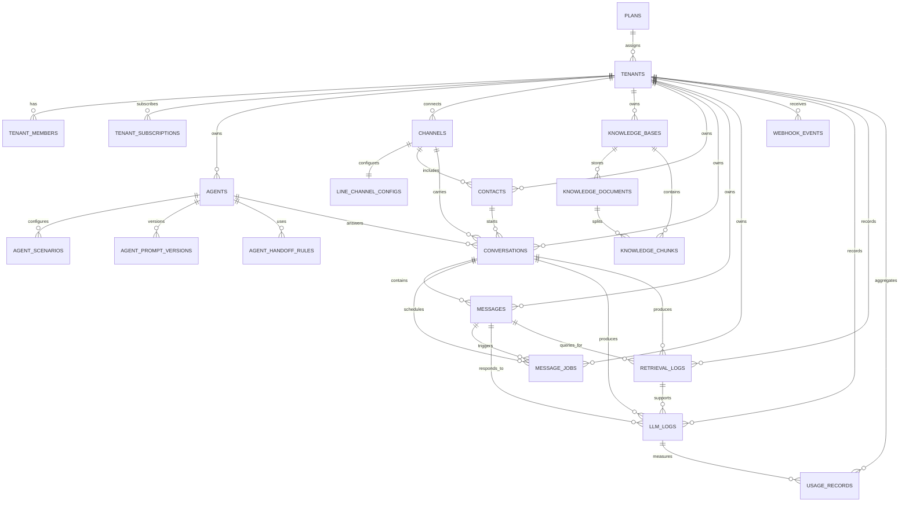

# ERD 與資料關係說明

## 1. ERD

## 2. 設計重點

### 2.1 多租戶隔離

- 幾乎所有業務表都帶 `tenant_id`
- RLS 以 `tenant_members` 與 `platform_admins` 決定可見範圍
- `platform_admin` 可跨租戶查看，`tenant_owner` 僅能看自己的租戶資料

### 2.2 MVP 與資料模型的分離

產品規則先限制：

- 一個 tenant 只啟用一個 agent
- 一個 tenant 只綁一個主要 LINE channel
- 一個 tenant 只使用一個預設 knowledge base

資料模型仍保留未來擴張空間：

- `agents` 可支援多筆
- `channels` 可支援多筆
- `knowledge_bases` 可支援多筆

### 2.3 對話狀態機

`conversations.status`：

- `bot_active`
- `handoff_requested`
- `human_active`
- `closed`

MVP 真正重要的是 `human_active`，因為它直接影響 runtime 是否還要送 LLM。

### 2.4 可觀測性資料鏈

資料追蹤路徑：

- webhook 進來後先進 `webhook_events`
- 寫入 `messages`
- 建立 `message_jobs`
- 執行 RAG 後寫 `retrieval_logs`
- 呼叫 LLM 後寫 `llm_logs`
- 最後寫 `usage_records`

這條鏈可以支撐：

- 找 webhook 問題
- 找回覆錯誤原因
- 分析 token 與成本
- 做 Playground 可視化

## 3. 建議的主要查詢路徑

### 商家看對話列表

- `conversations`
- join `contacts`
- join 最近一筆 `messages`

### 商家看某段對話

- `conversations`
- `messages order by created_at asc`

### Playground debug

- `agent_scenarios`
- `knowledge_chunks`
- `retrieval_logs`
- `llm_logs`

### 平台看商家使用狀況

- `tenants`
- `usage_records`
- `llm_logs`
- `message_jobs`

## 4. 之後可能新增但目前不需要的表

以下建議明確延後：

- `agent_knowledge_base_bindings`
- `billing_invoices`
- `support_tickets`
- `human_agent_sessions`
- `channel_message_templates`

