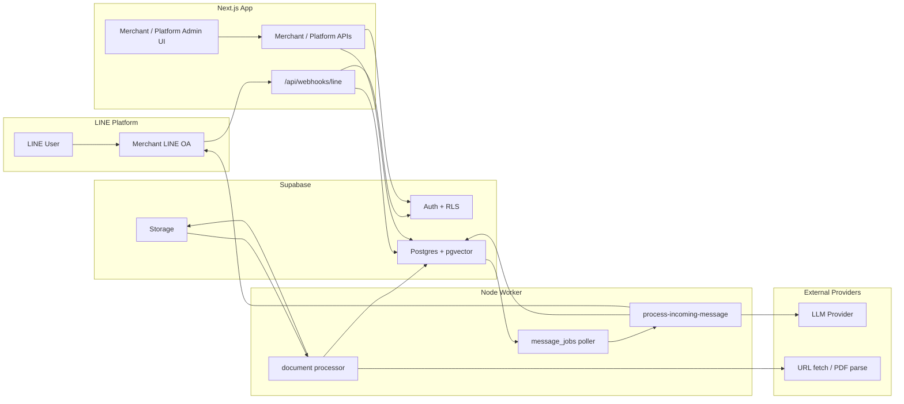
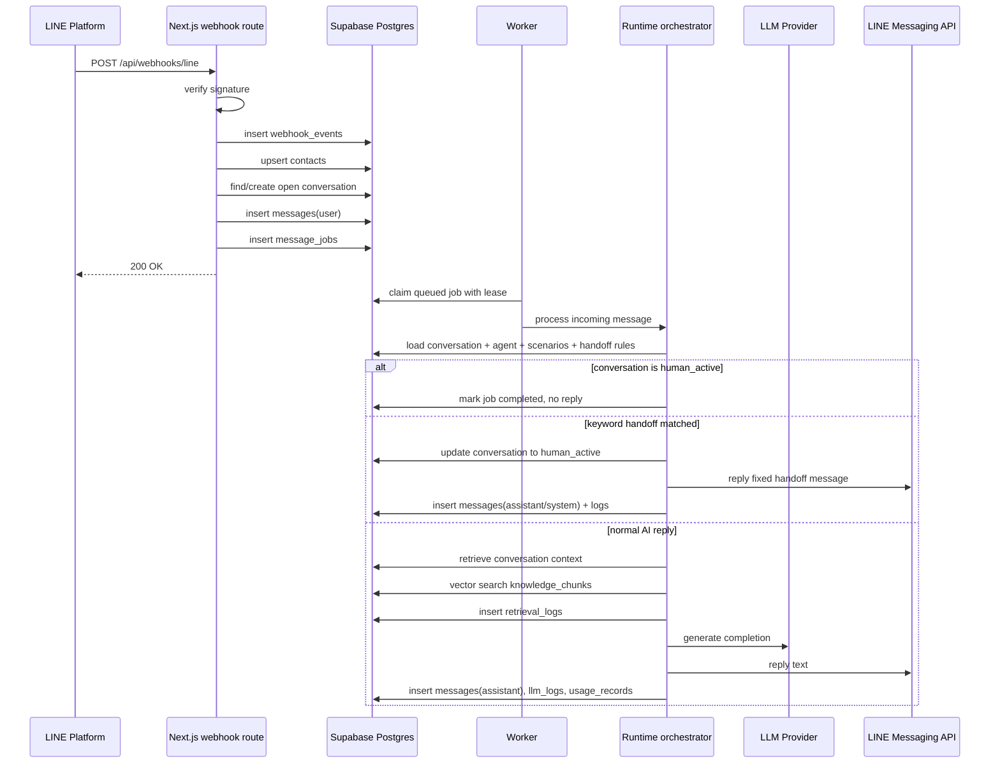

# Abo Agent MVP Build Spec

- Version: v1.0
- Date: 2026-04-20
- Status: Finalized for MVP build
- Scope: `abo-agent-by-own` current repository context

## 1. Product Definition

`Abo Agent` 是一個給商家使用的 `LINE OA AI 客服助手 SaaS`。MVP 只解決一件事：讓商家把既有 FAQ / PDF / 單頁網站內容接進來，接上 LINE OA，對常見問題做可控、可觀察、可轉真人的 AI 自動回覆。

這版 MVP 不做：

- 多 agent 協作
- 多通路整合
- 內建人工客服台
- 視覺化 workflow builder
- 自動扣款 billing
- 整站爬蟲與複雜同步排程

## 2. Six Final Decisions

說明：repo 內現有 draft spec 已明確拍板 5 項，我將第 6 項補成「webhook 非同步化」並正式納入，因為它已經出現在現有文件與程式骨架中，但還沒有被寫成核心決策。

| # | Decision Topic | Final Value | Reason |
| --- | --- | --- | --- |
| 1 | Tenant 是否先支援多 agent | `否，MVP 限制 1 tenant = 1 active agent` | 這是最大複雜度控制點。先把後台、路由、知識庫掛載、prompt version 與對話綁定壓到單一 agent，能明顯降低 UI 與資料模型分歧。 |
| 2 | Playground 是否顯示 retrieval debug | `是，只給 merchant owner / platform admin 看` | 沒有 retrieval 可視性，商家與平台都無法判斷是知識庫沒命中、scenario 選錯，還是 prompt 品質問題。MVP 只顯示 top-k chunks、score、scenario。 |
| 3 | URL knowledge 是否做整站抓取 | `否，MVP 只支援單頁 URL` | 單頁抓取已足夠覆蓋門市資訊、FAQ、服務說明頁。整站抓取會引入 robots、導覽頁、排程刷新、去重與內容品質風險，不適合首版。 |
| 4 | 命中轉真人後 bot 是否繼續回覆 | `否，conversation 進入 human_active 後完全停止，直到後台手動 Resume AI` | 這是最安全的行為。因為 MVP 沒有內建人工客服台，若 bot 繼續回，就會和 LINE OA 原生人工回覆衝突。 |
| 5 | Merchant / Platform admin 是否拆兩個前端專案 | `否，MVP 使用同一個 Next.js App Router 專案` | 兩邊共用 auth、tenant context、表單元件、查詢邏輯與設計系統。拆專案只會增加部署與維運成本。 |
| 6 | LINE webhook 是否同步直接打 LLM | `否，MVP 必須採 webhook -> DB -> message_jobs -> worker 非同步流程` | webhook 必須快速回 200，不能把 LLM latency、重試、回覆失敗、重入去重都綁在 request lifecycle。這也是目前 `src/app/api/webhooks/line/route.ts` 與 `src/worker` 骨架最正確的演進方向。 |

## 3. MVP Scope in Abo Agent Context

MVP 的實際使用流程是：

1. 商家建立 tenant。
2. 商家設定唯一 active agent。
3. 商家上傳 FAQ / PDF / 單頁 URL。
4. 商家填入 LINE channel secret / access token。
5. LINE user 傳文字訊息到商家 LINE OA。
6. webhook 寫入事件、對話、訊息與 job。
7. worker 取 job，判斷是否 `human_active`。
8. 若命中 handoff keyword，回固定轉真人訊息並停止 bot。
9. 若未命中，做 scenario routing、knowledge retrieval、LLM 回覆。
10. 回覆 LINE 並寫入 retrieval / llm / usage logs。

MVP 首版只處理：

- LINE 文字訊息
- FAQ / PDF / URL 三種知識來源
- 規則式 scenario routing
- top-k vector retrieval
- 後台 Resume AI
- merchant 與 platform admin 兩種角色

## 4. System Architecture



### 4.1 Architecture Rules

- Next.js 只做 web UI、admin APIs、webhook ingress。
- 所有重工作都進 Postgres queue，不在 webhook request 內處理。
- `src/server/domain` 放業務規則，`src/server/services` 放第三方整合。
- worker 與 web app 共用同一份 domain / service code。
- 所有 tenant-facing 核心資料都帶 `tenant_id`。
- 商家頁走 Supabase session + RLS；背景任務走 service-role。

## 5. Runtime Responsibilities

| Module | Responsibility | Current Repo Anchor |
| --- | --- | --- |
| Webhook Ingestion | 驗證 LINE signature、寫入 webhook event、落 messages / jobs、快速回 200 | `src/app/api/webhooks/line/route.ts` |
| Runtime Orchestrator | handoff 判斷、scenario routing、retrieval、LLM、reply、logs | `src/server/domain/runtime/process-incoming-message.ts` |
| LINE Service | signature verify、reply message、後續 push/reply API | `src/server/services/line/*` |
| Retrieval Service | embedding、vector search、top-k chunk format | `src/server/services/retrieval/*` |
| LLM Service | prompt assembly、provider adapter、usage extraction | `src/server/services/llm/*` |
| Jobs Service | enqueue、claim、lease、retry、dead-letter | `src/server/services/jobs/*` |
| Worker | poll queue、執行 message / document jobs | `src/worker/*` |
| Merchant Admin | Agent、Scenarios、Knowledge、LINE、Conversations、Playground | `src/app/(merchant)/*` |
| Platform Admin | tenants、logs、usage 管理面板 | `src/app/(platform)/*` |

## 6. Supabase Data Model Draft

以下以目前 `supabase/schema.sql` 為基礎，列出 MVP 真正要用到的表與用途。

### 6.1 Identity and Tenant

| Table | Core Columns | Purpose |
| --- | --- | --- |
| `platform_admins` | `user_id` | 標記可跨 tenant 管理的內部帳號。 |
| `plans` | `code`, `name`, `message_quota`, `document_quota`, `feature_flags` | 保留方案 gating，MVP 可先人工開通。 |
| `tenants` | `slug`, `name`, `status`, `plan_id`, `owner_user_id`, `settings` | 商家租戶主表。 |
| `tenant_members` | `tenant_id`, `user_id`, `role` | 商家成員，MVP 只需 `owner`、`admin`。 |
| `tenant_subscriptions` | `tenant_id`, `plan_id`, `status`, `current_period_*` | 先保留，不做自動扣款。 |

### 6.2 Agent and Prompt

| Table | Core Columns | Purpose |
| --- | --- | --- |
| `agents` | `tenant_id`, `name`, `status`, `brand_name`, `brand_tone`, `forbidden_topics`, `fallback_policy`, `config` | 商家唯一 active agent 主設定。 |
| `agent_prompt_versions` | `agent_id`, `version_no`, `status`, `prompt_snapshot` | 保存 prompt assembly 結果，讓設定可追溯。 |
| `agent_scenarios` | `agent_id`, `scenario_type`, `name`, `routing_keywords`, `prompt_config`, `sort_order`, `is_enabled` | 一般 FAQ / 售前 / 售後 / 門市資訊等 scenario。 |
| `agent_handoff_rules` | `agent_id`, `rule_name`, `keywords`, `auto_reply_text`, `is_enabled` | 關鍵字轉真人規則。 |

### 6.3 Channel and Contact

| Table | Core Columns | Purpose |
| --- | --- | --- |
| `channels` | `tenant_id`, `provider`, `name`, `status`, `is_primary` | 租戶通路入口。MVP 只會有一筆 LINE primary channel。 |
| `line_channel_configs` | `channel_id`, `channel_id_external`, `channel_secret_ciphertext`, `channel_access_token_ciphertext`, `webhook_url`, `webhook_verified_at` | LINE 敏感設定與驗證狀態。 |
| `contacts` | `tenant_id`, `channel_id`, `external_user_id`, `display_name`, `profile`, `last_seen_at` | LINE user 映射成 tenant 內 contact。 |

### 6.4 Knowledge Base

| Table | Core Columns | Purpose |
| --- | --- | --- |
| `knowledge_bases` | `tenant_id`, `name`, `is_default` | MVP 一個 tenant 一個 default KB，但保留多 KB 擴充。 |
| `knowledge_documents` | `knowledge_base_id`, `source_type`, `title`, `source_url`, `storage_path`, `raw_text`, `checksum`, `processing_status`, `processing_error` | FAQ / PDF / URL 文件主表。 |
| `knowledge_chunks` | `document_id`, `chunk_index`, `content`, `token_count`, `embedding_model`, `embedding`, `metadata` | chunk 與向量索引。 |

### 6.5 Conversation Runtime

| Table | Core Columns | Purpose |
| --- | --- | --- |
| `conversations` | `tenant_id`, `channel_id`, `contact_id`, `agent_id`, `status`, `scenario_id`, `last_message_at`, `handoff_requested_at`, `human_activated_at` | 對話主狀態機。 |
| `messages` | `conversation_id`, `external_message_id`, `role`, `source`, `content`, `metadata` | LINE 使用者訊息、assistant 回覆與 system 訊息。 |
| `message_jobs` | `conversation_id`, `message_id`, `job_type`, `status`, `retry_count`, `available_at`, `locked_at`, `lease_expires_at`, `last_error` | 非同步 runtime queue。 |

### 6.6 Observability

| Table | Core Columns | Purpose |
| --- | --- | --- |
| `webhook_events` | `provider`, `provider_event_id`, `event_type`, `payload`, `status`, `processing_error` | 每次 LINE webhook 原始事件落地與去重。 |
| `retrieval_logs` | `conversation_id`, `message_id`, `query_text`, `retrieved_chunks` | Playground 與排錯要看的 retrieval 結果。 |
| `llm_logs` | `conversation_id`, `message_id`, `retrieval_log_id`, `model_provider`, `model_name`, `scenario_type`, `request_payload`, `response_payload`, `total_tokens`, `latency_ms` | LLM 請求與回覆 metadata。 |
| `usage_records` | `tenant_id`, `conversation_id`, `llm_log_id`, `metric_date`, `message_count`, `total_tokens`, `estimated_cost` | 日級 usage 聚合。 |

### 6.7 Required Constraints

- `agents_one_active_per_tenant_idx`: 保證一個 tenant 只有一個 active agent。
- `channels_one_primary_per_tenant_provider_idx`: 保證一個 tenant 只有一個 primary LINE channel。
- `knowledge_bases_one_default_per_tenant_idx`: 保證一個 tenant 一個 default KB。
- `conversations_one_open_per_contact_idx`: 同一 contact 只允許一個 open conversation。
- `messages_external_message_id_idx`: 防止 LINE 重送造成 message 重複落庫。
- `message_jobs unique (message_id)`: 防止同一 inbound message 被重複排隊。

## 7. Conversation State Machine

| Status | Meaning | Enter Condition | Exit Condition |
| --- | --- | --- | --- |
| `bot_active` | AI 正常自動回覆 | 新對話建立或 Resume AI | 命中 handoff rule、人工關閉、結案 |
| `handoff_requested` | 保留中間態，可選擇不長時間停留 | 命中 handoff keyword 當下 | 立刻轉成 `human_active` |
| `human_active` | AI 停止，交由商家從 LINE OA 原生後台接手 | 系統發送轉真人固定文案後 | 商家後台點 `Resume AI` |
| `closed` | 對話已結束 | 後續可由排程或人工結案 | 新訊息進來時新開或重開對話 |

MVP 實作要求：

- runtime 讀到 `human_active` 必須直接 skip LLM。
- `Resume AI` 只允許從後台操作，不允許 webhook 自動恢復。
- `handoff_requested` 可保留做稽核，但 worker 完成固定回覆後應落到 `human_active`。

## 8. LINE Webhook Event Flow



### 8.1 Ingestion Rules

- 只接受 LINE text message event。
- 非 text 類型先記錄 `webhook_events`，不進 runtime。
- webhook route 必須 idempotent。
- signature 驗證失敗直接回 `401 LINE_SIGNATURE_INVALID`。
- webhook route 不直接呼叫 LLM，也不直接呼叫 retrieval。

### 8.2 Worker Rules

- job claim 採 lease-based locking。
- 發生可重試錯誤時增加 `retry_count` 並延後 `available_at`。
- 超過 `max_retries` 後轉 `dead_letter`。
- 回 LINE 失敗必須保留 `last_error` 與 job / llm log 關聯線索。

## 9. Prompt and Retrieval Policy

### 9.1 Prompt Assembly

runtime 每次組 prompt 的順序固定如下：

1. Base system prompt
2. Agent brand config
3. Scenario prompt
4. Retrieval context
5. Runtime safety policy
6. Recent conversation context
7. Current user input

### 9.2 Prompt Sources

| Layer | Source |
| --- | --- |
| Base system prompt | code constant / published default |
| Agent brand config | `agents` |
| Scenario prompt | `agent_scenarios.prompt_config` |
| Retrieval context | `knowledge_chunks` top-k |
| Runtime policy | code constant |
| Version snapshot | `agent_prompt_versions.prompt_snapshot` |

### 9.3 Retrieval Rules

- 只對 `ready` documents 產生 chunks。
- 首版先做單一 vector retrieval，不做 reranker。
- top-k 建議先固定 `3~5`。
- Playground 與 logs 顯示 document title、score、chunk content 頭部片段。
- 資料不足時走 fallback policy，不得硬答。

## 10. Next.js Module Cut

目標是沿用目前 repo 已存在的 `app / server / worker` 骨架，不再把核心流程塞進 route handlers。

```text
src/
  app/
    (marketing)/
    (auth)/
    (merchant)/
      dashboard/
      agent/
      scenarios/
      knowledge/
      line/
      conversations/
      playground/
      settings/
    (platform)/
      platform/
      platform/tenants/
      platform/logs/
      platform/usage/
    api/
      tenant/setup/
      agent/
      scenarios/
      knowledge/documents/
      line/connect/
      conversations/
      playground/run/
      platform/tenants/
      platform/logs/errors/
      platform/usage/
      webhooks/line/

  components/
    layout/
    ui/
    forms/
    tables/
    conversations/
    playground/

  features/
    agent/
    scenario/
    knowledge/
    line/
    conversation/
    platform/

  lib/
    env.ts
    auth/
    supabase/
    utils/

  server/
    domain/
      tenant/
      agent/
      scenario/
      knowledge/
      channel/
      conversation/
      runtime/
      billing/
    services/
      line/
      llm/
      retrieval/
      documents/
      jobs/
    repositories/
      tenant/
      agent/
      knowledge/
      conversation/
      channel/
      logs/
    http/
    dto/
    validators/

  worker/
    index.ts
    process-message-job.ts
    process-document-job.ts
    retry-policy.ts
```

### 10.1 Module Boundary

| Layer | Must Do | Must Not Do |
| --- | --- | --- |
| `src/app/api/*` | auth、validate、call domain、map response | 寫 runtime 主流程、直接組 prompt、直接打第三方 |
| `src/server/domain/*` | 寫商業規則與狀態轉換 | 放 HTTP request parsing 細節 |
| `src/server/services/*` | 封裝 LINE、LLM、documents、retrieval、jobs 技術細節 | 承擔 tenant policy 決策 |
| `src/server/repositories/*` | 封裝 Supabase/Postgres query | 混入 UI 或 provider logic |
| `src/worker/*` | poll queue、執行 orchestrator、寫 retry policy | 寫一份與 web app 不同的 domain 邏輯 |
| `src/components` / `src/features` | 表單、表格、頁面組件 | 直接查 service-role DB |

### 10.2 Repo-Specific Implementation Notes

- 現有 `src/server/domain/runtime/process-incoming-message.ts` 要升級成真正 orchestrator。
- 現有 `src/server/services/jobs/enqueue.ts`、`claim-job.ts` 目前是 stub，後續應改成 DB-backed queue repository。
- `src/app/api/webhooks/line/route.ts` 目前只做 signature stub + enqueue demo，應改成正式 ingestion flow。
- `src/server/services/line/line-signature.ts` 與 `line-client.ts` 要從 stub 改成真實 LINE SDK adapter。
- `src/server/domain/conversation/*`、`knowledge/*` 目前部分仍 mock-backed，要改為 tenant-safe repository。

## 11. API Boundary for MVP

### 11.1 Merchant APIs

- `POST /api/tenant/setup`
- `GET /api/agent`
- `PATCH /api/agent`
- `GET /api/scenarios`
- `PATCH /api/scenarios/:scenarioId`
- `POST /api/knowledge/documents`
- `GET /api/knowledge/documents`
- `DELETE /api/knowledge/documents/:documentId`
- `POST /api/line/connect`
- `GET /api/conversations`
- `GET /api/conversations/:conversationId`
- `POST /api/conversations/:conversationId/resume-bot`
- `POST /api/playground/run`

### 11.2 Platform APIs

- `POST /api/platform/tenants`
- `GET /api/platform/tenants`
- `GET /api/platform/tenants/:tenantId`
- `PATCH /api/platform/tenants/:tenantId`
- `GET /api/platform/logs/errors`
- `GET /api/platform/usage`

### 11.3 Public Integration API

- `POST /api/webhooks/line`

## 12. MVP Development Order

### Phase 0: Foundation Hardening

Goal:
把 repo 內已有的 schema、auth guard、route skeleton 對齊成可持續開發的底盤。

Deliverables:

- 補齊 repository layer
- 把 mock/stub flow 明確標記並收斂
- 確認 `supabase/schema.sql` 可完整 migrate
- 確認 tenant guard / platform guard 測試能過

### Phase 1: Webhook Main Path

Goal:
打通最核心的 `webhook -> conversation/message -> message_jobs -> worker` 主幹。

Deliverables:

- `webhook_events` 真實落庫
- `contacts` upsert
- open conversation 查找與建立
- inbound `messages` 落庫
- `message_jobs` enqueue / claim / lease
- worker 可處理 queued job 並完成狀態轉換

Exit Criteria:

- LINE text message 進來後，DB 可完整看到 event、message、job。

### Phase 2: LINE Reply and Handoff

Goal:
先把可控自動回覆與轉真人安全機制做穩，不先追求複雜 AI。

Deliverables:

- 真實 LINE signature verify
- 真實 LINE reply API
- `agent_handoff_rules` 查詢與 keyword match
- `human_active` / `Resume AI` 完整狀態流
- assistant/system message 落庫

Exit Criteria:

- 命中 handoff keyword 可停 bot，後台可 Resume AI。

### Phase 3: Knowledge and Retrieval

Goal:
讓回覆不只靠靜態 prompt，而能使用商家資料。

Deliverables:

- FAQ / PDF / URL 建立文件
- document processing job
- parse / normalize / chunk / embedding
- `knowledge_chunks` vector retrieval
- retrieval logs

Exit Criteria:

- Playground 與 runtime 都能查到可用的 top-k chunks。

### Phase 4: Prompt Assembly and LLM

Goal:
把 scenario、retrieval、brand config 接進回覆品質主流程。

Deliverables:

- published prompt version 機制
- runtime prompt assembly
- scenario routing
- LLM provider adapter
- llm logs / usage records
- fallback policy

Exit Criteria:

- 正常 FAQ 類問題可回出帶 context 的 AI answer，並留下可觀測 log。

### Phase 5: Merchant Admin MVP

Goal:
把商家後台做成可自己配置、可自己 debug。

Deliverables:

- Agent page
- Scenarios page
- Knowledge page
- LINE integration page
- Conversations list/detail
- Playground

Exit Criteria:

- 商家可自行完成設定、測試、查看對話與恢復 AI。

### Phase 6: Platform Admin and Operations

Goal:
讓平台方可以代營運、排錯、看 usage。

Deliverables:

- platform tenant list/detail
- platform error logs
- platform usage view
- manual plan gating
- dead-letter / failed job 查修流程

Exit Criteria:

- 平台 admin 可支援多商家內測與試營運。

## 13. MVP Acceptance Criteria

以下條件全部成立，才算 `abo-agent-by-own` MVP 可進內測：

- 商家可註冊並完成 tenant setup。
- 商家可設定唯一 active agent。
- 商家可成功接上 LINE OA 並驗證 webhook。
- 商家可新增 FAQ、PDF、URL 文件並看到 processing status。
- LINE user 發送文字訊息後，系統能穩定回覆。
- 命中 handoff keyword 時，AI 會停止直到後台 Resume AI。
- 商家可在後台看到 conversation list/detail。
- 商家可在 Playground 看到 scenario、retrieval 與 output。
- 平台 admin 可查看 tenants、errors、usage。
- 所有核心 runtime 都可在 DB 裡追蹤到 webhook、job、retrieval、llm、usage 鏈路。

## 14. Explicit Non-Goals for This Build

- 不做多 agent UI
- 不做人工聊天介面
- 不做 rich menu / image / audio message
- 不做整站爬蟲與自動 refresh scheduler
- 不做 CRM / ERP / 訂單系統串接
- 不做商家自帶 API key
- 不做多模型選擇器
- 不做自動收費 checkout / invoicing

## 15. Build Recommendation Summary

`abo-agent-by-own` 的 MVP 不該再發散成通用 AI 平台，而要嚴格守住這條主線：

`1 tenant -> 1 active agent -> 1 primary LINE channel -> 1 default knowledge base -> async message runtime`

只要這條主線先做穩，商家就能完成設定、接上 LINE、用知識庫回答 FAQ、必要時轉真人，平台也有足夠的 observability 來排錯與代營運。這就是這個 repo 現階段最正確的 MVP build target。
